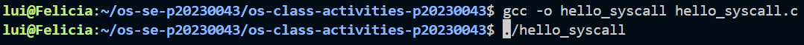
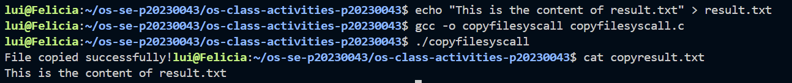

# Class Activity 1 — System Calls in Practice

- **Student Name:** HEN Chhorda Vattey
- **Student ID:** p20230043
- **Date:** [Date of Submission]

---

## Warm-Up: Hello System Call

Screenshot of running `hello_syscall.c` on Linux:

Screenshot of running `hello_winapi.c` on Windows (CMD/PowerShell/VS Code):

Screenshot of running `copyfilesyscall.c` on Linux:

